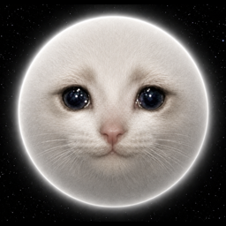

<div align="center">



# Moon Cat 🌙🐱

### The first reflection token on Robinhood Chain

**Hold $MOONCAT, earn $MOONCAT** — a slice of every trade is paid to every holder, automatically, on-chain. No staking, no claiming. Your wallet just grows while the cat naps. 😴

[🌐 Website](https://mooncat.online) · [𝕏 Twitter](https://x.com/mooncat0x) · [📈 DexScreener](https://dexscreener.com/robinhood/0x34ED546b3F258357aa5e3AB5d9eF262206707285) · [🔍 Explorer](https://robinhoodchain.blockscout.com/token/0x853587c7952a47C2E2bEEc97E2ba8d51Ca83bEfc) · [📄 Audit](media/Audit.pdf)

</div>


## 🐾 What is Moon Cat?

SafeMoon made reflections famous: a token that pays you just for holding it. **Moon Cat brings that mechanic to Robinhood Chain — first.** Every trade, 1.5% is split across all holders, proportional to what you hold, the instant the trade settles. No dashboards, no lockups, no gas to claim.

## 💸 The 5% Tax

Every trade pays a flat 5%, the same on the way in and the way out:

| Slice | Fee | What it does |
|:--|:--:|:--|
| 🎁 **Auto Airdrop** | 1.5% | Reflections paid to every holder |
| 💧 **Liquidity** | 1.5% | Auto-added to the pool — the floor deepens with every trade |
| ❤️ **Charity** | 1.5% | Sent to a dedicated charity wallet |
| 🔥 **Burn** | 0.5% | Destroyed forever — supply only goes down |

> Fees are **hard-capped at 10% in the contract** — no one, including the team, can ever set them higher.

## 🪙 Tokenomics

**1,000,000,000 $MOONCAT** — fixed supply, no mint function, ever.

| Allocation | Share |
|:--|:--:|
| 🔥 Burned | **50%** |
| 💧 Liquidity | **30%** |
| 🏦 Treasury | **20%** |

## 🛡️ $MOONCAT is SAFU

Rules the code enforces, not promises:

- ✅ **Verified source** on Blockscout — read every line yourself
- ✅ **Liquidity burned** — the pool can never be pulled
- ✅ **Max buy 1%** of supply — no single trade shocks the chart
- ✅ **Max wallet 2%** of supply — whales are structurally impossible
- ✅ **Fee ceiling 10%**, coded in — every change emits a public event
- ✅ **Independent security review** — [read the audit](media/Audit.pdf)

## 🛒 How to Buy

1. **Get ETH on Robinhood Chain** — bridge or withdraw ETH to the network (Chain ID `4663`)
2. **Open [Uniswap](https://app.uniswap.org/swap?chain=robinhood&outputCurrency=0x853587c7952a47C2E2bEEc97E2ba8d51Ca83bEfc)** with Robinhood Chain selected
3. **Swap ETH for $MOONCAT** — set slippage to **5–10%** to cover the tax. Reflections start the moment tokens land. 🚀

## 📜 Contract

```
0x853587c7952a47C2E2bEEc97E2ba8d51Ca83bEfc
```

- **Network:** Robinhood Chain (Chain ID 4663)
- **Symbol:** MOONCAT · **Decimals:** 18 · **Supply:** 1,000,000,000

## ⚠️ Disclaimer

$MOONCAT is a meme token with no intrinsic value and no expectation of financial return. It is **not** affiliated with, endorsed by, or connected to Robinhood Markets — it simply lives on Robinhood Chain. Nothing here is financial advice. Never spend more than you can afford to lose. DYOR. 🐾
